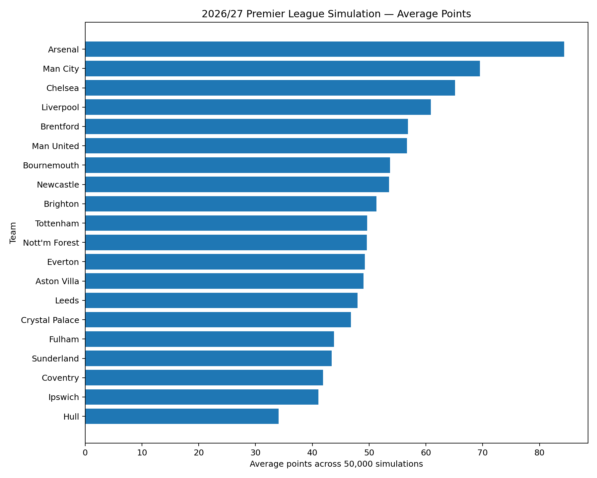
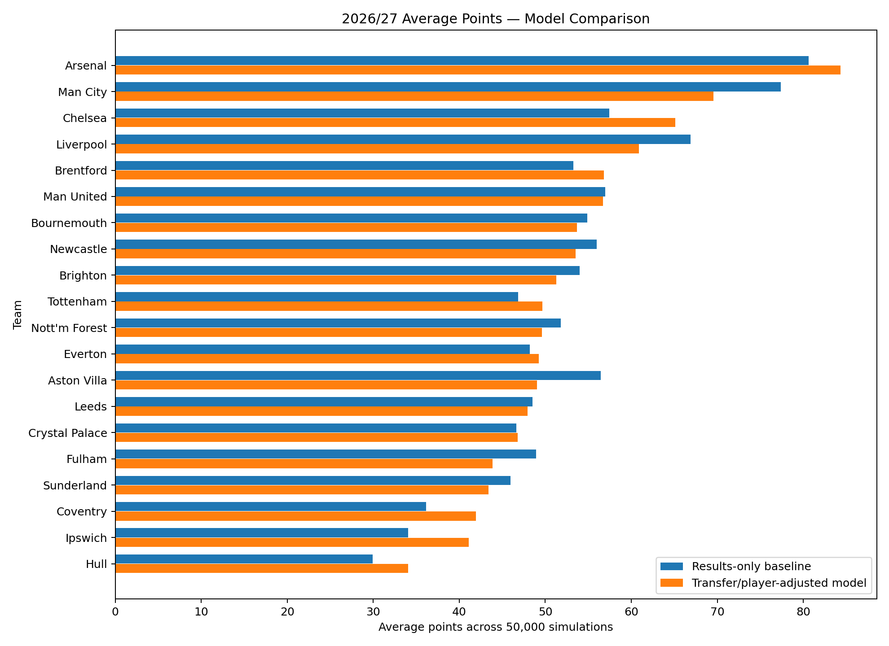

# Premier League Predictor & Season Simulator

A Python-based football analytics and Monte Carlo simulation project that models a Premier League season using historical results, team ratings, promoted-team calibration, player performance and transfer activity.

The current included example run simulates the **2026/27 Premier League season** using 50,000 simulated seasons and produces average league position, average points, title probability, top-four probability and relegation probability for each team.

> **Note:** The results stored in this repository are a dated model snapshot, not a live forecast. The included transfer-adjusted run uses transfer data frozen on **24 August 2026**.

## Features

- Historical Premier League match analysis
- Exponential recency weighting with a 365-day half-life
- Separate home/away attack and defence team ratings
- Championship-to-Premier-League calibration for promoted teams
- Player quality and role-importance modelling
- Transfer-player matching using exact and fuzzy name matching
- Transfer-based attack and defence adjustments
- Poisson-based expected-goals model
- Monte Carlo season simulation
- Comparison between a results-only baseline and a transfer/player-adjusted model
- CSV output for further analysis

## Model pipeline

```text
Historical Premier League Results
                │
                ▼
       Recency Weighting
                │
                ▼
          Team Ratings
                │
        ┌───────┴────────┐
        ▼                ▼
 Player Performance   Promoted Teams
        │                │
        └───────┬────────┘
                ▼
      Transfer Adjustments
                │
                ▼
       Expected Goals (Poisson)
                │
                ▼
        Match Simulation
                │
                ▼
       50,000 Season Runs
                │
                ▼
        Predicted League Table
```

## Methodology

### 1. Historical team ratings

The model loads Premier League results from the 2023/24, 2024/25 and 2025/26 seasons. More recent matches receive greater weight using exponential decay with a 365-day half-life.

For each team, the model calculates separate:

- Home attacking strength
- Home defensive strength
- Away attacking strength
- Away defensive strength

These are normalized against league-wide home and away scoring averages.

### 2. Promoted teams

Teams entering the Premier League are not given a direct Premier League rating from historical matches because they may not have recent Premier League data. Championship performance is therefore combined with a historical promoted-team baseline through a calibrated conversion step.

The repository also contains historical Championship/Premier League season pairs used by the promotion calibration module.

### 3. Player and transfer impact

The transfer model combines transfer records with player statistics. Player names are normalized and matched against available player datasets using exact matching followed by fuzzy matching when necessary.

Player quality is estimated relative to a reference population and adjusted for role importance. The resulting player impact is split between attacking and defensive contributions according to position.

Transfer effects are then aggregated at team level and applied to the underlying team ratings.

### 4. Match modelling

Expected goals are calculated from the attacking and defensive ratings of the two teams. Goals are then generated using Poisson distributions.

### 5. Monte Carlo simulation

A complete league season is simulated repeatedly. The current example output uses **50,000 simulations**.

For each team, the model records:

- Average finishing position
- Average points
- Title probability
- Top-four probability
- Relegation probability

## Example results

The following charts are generated from the included 2026/27 result files.

### Average points



### Results-only vs transfer/player-adjusted model



The comparison is intended to show how adding transfer/player adjustments changes the simulated distribution relative to the results-only baseline; it should not be interpreted as evidence that the adjustment model is more accurate without out-of-sample validation.

## Project structure

```text
premier-league-predictor/
├── data/
│   ├── Premier League historical results
│   ├── Championship results
│   ├── player_data/
│   └── transfer_data/
├── results/
│   ├── baseline_results_only_2026_27.csv
│   ├── model_2a_transfers_2026_27.csv
│   ├── 2026_27_average_points.png
│   └── 2026_27_model_comparison.png
├── src/
│   ├── api_client.py
│   ├── broader_player_loader.py
│   ├── data_loader.py
│   ├── player_data_loader.py
│   ├── player_impact.py
│   ├── poisson.py
│   ├── promotion_calibration.py
│   ├── ratings.py
│   ├── simulator.py
│   ├── table.py
│   ├── transfer_impact.py
│   ├── transfer_loader.py
│   └── transfer_player_matcher.py
├── main.py
├── requirements.txt
└── .gitignore
```

## Installation

Python **3.10+** is recommended.

Create and activate a virtual environment:

```bash
python -m venv .venv
```

Windows PowerShell:

```powershell
.\.venv\Scripts\Activate.ps1
```

Install dependencies:

```bash
pip install -r requirements.txt
```

## Usage

Run the default 50,000-season simulation:

```bash
python main.py
```

For a quick test run with fewer simulations:

```bash
python main.py --simulations 100
```

Choose a different output filename:

```bash
python main.py --simulations 10000 --output example_results.csv
```

The generated CSV is saved in the `results/` directory.

## Data and reproducibility

The prediction is based on the CSV datasets included in this repository. The main prediction pipeline uses the three most recent Premier League seasons available to the model and a frozen transfer dataset so that the included example run can be reproduced without relying on live transfer information.

The transfer loader also contains functionality for retrieving and freezing transfer data from the web. The core prediction does **not** require an API key because it uses the saved transfer snapshot.

An optional `api_client.py` utility is included for API-Football access. If it is used, the API key should be supplied through the `API_FOOTBALL_KEY` environment variable and should never be committed to the repository.

## Limitations

This project is an experimental simulation model rather than a production forecasting system. In particular:

- The model does not account for every factor affecting football matches.
- Player impact is estimated from available statistics and role assumptions.
- Transfer effects are modelled heuristically rather than learned from a large historical transfer dataset.
- Injuries, managerial changes, preseason performance and many contextual factors are not currently modelled.
- The Poisson goal model assumes a simplified scoring process.
- The included probabilities are simulation outputs and depend on the assumptions and data snapshot used.
- Model quality should be evaluated with historical backtesting and out-of-sample validation before making claims about predictive accuracy.

## Future improvements

- Historical backtesting across multiple seasons
- More rigorous calibration of transfer effects
- Injury and manager-change adjustments
- Expected-goals-based team ratings
- Home-advantage calibration by season
- Additional predictive models for comparison
- Automated data refresh with versioned datasets
- Interactive visualization of simulation results

## Technologies

- Python
- Pandas
- NumPy
- SciPy
- Scikit-learn
- Requests
- RapidFuzz

